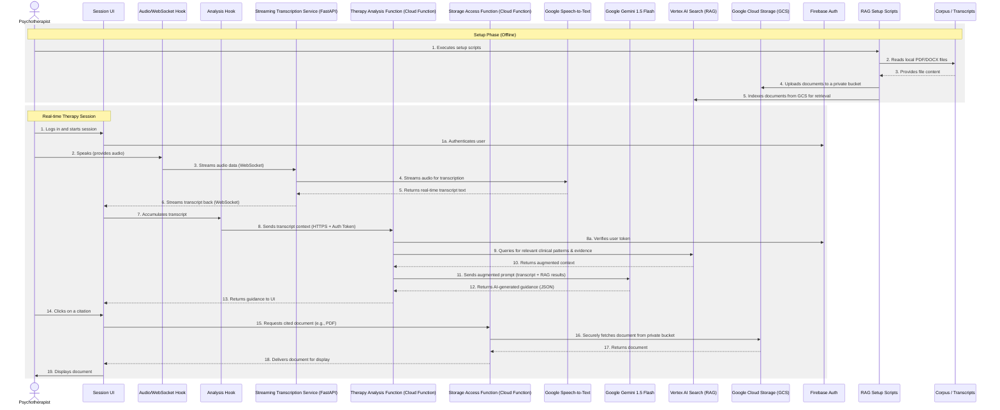

# Ther-Assist Interaction Sequence

This diagram shows the high-level interaction sequence for the Ther-Assist application, from the offline setup phase to the real-time analysis during a therapy session.

