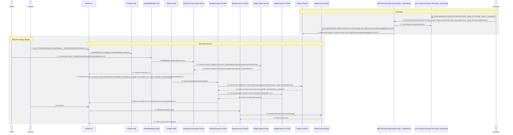

# Ther-Assist Interaction Sequence

This document outlines the component interactions for the Ther-Assist application, including references to the code responsible for each step.

```mermaid
sequenceDiagram

    actor Patient as Patient
    actor Therapist as Therapist
    participant Frontend_UI as Session UI
    participant FirebaseAuth as Firebase Auth
    participant Frontend_Audio as Audio/WebSocket Hook
    participant Frontend_Analysis as Analysis Hook
    participant TranscriptionService as Streaming Transcription Service
    participant AnalysisFunction as Therapy Analysis Function
    participant StorageProxy as Storage Access Function
    participant SpeechToText as Google Speech-to-Text
    participant Gemini as Google Gemini 2.5 Flash
    participant RAG as Vertex AI Search
    participant GCS as Google Cloud Storage
    participant SetupScripts as RAG/Transcript Setup Scripts setup_*_datastore.py
    participant Corpus as Local Corpus/Transcripts Files setup_services/rag/
    actor Developer as Developer

    rect rgb(240, 240, 240)
        note over Developer, RAG: Presession
        Developer->>Corpus: 1. Upload appropriate corpus/transcripts documents (`setup_services/rag/ >corpus/ >transcripts/`)
        Developer->>SetupScripts: 2. Execute RAG and transcript GCS setup scripts (`setup_services/rag/ >setup_rag_datastore.py >setup_transcript_datastore.py`)
        SetupScripts->>Corpus: 3. Load corpus/transcript documents
        SetupScripts->>GCS: 4. Format/Write/Index loaded documents to Cloud Storage (see `https://discoveryengine.googleapis.com/v1/`)
        SetupScripts->>RAG: 5. Indexes documents in Vertex AI Search (see `https://discoveryengine.googleapis.com/v1/`)
    end

    rect rgb(240, 240, 240)
        note over Patient, Therapist: Real-time Therapy Session
        note over Frontend_UI, GCS: Ther-assist Service
        Therapist->>Frontend_UI: 6. Log in (`frontend/components/LoginPage.tsx`, `frontend/contexts/AuthContext.tsx`)
        Frontend_UI->>FirebaseAuth: 7. Authentication via Firebase (`frontend/firebase-config.ts`)
        
        Patient->>Frontend_Audio: 8. Conversation audio (`frontend/hooks/useAudioRecorderWebSocket.ts`)
        Frontend_Audio->>TranscriptionService: 9. WebSocket to Transcription Service
        
        TranscriptionService->>SpeechToText: 10. Forwards audio to Speech-to-Text API (`backend/streaming-transcription-service/main.py`)
        SpeechToText-->>TranscriptionService: 11. Returns real-time transcript (via `google.cloud.speech_v2.SpeechClient`)
        TranscriptionService-->>Frontend_UI: 12. Streams transcript to UI
        
        Frontend_UI->>Frontend_Analysis: 13. Sends transcript for analysis (`backend/streaming-transcription-service/main.py`, google.cloud.speech_v2, session.method() & StreamingRecognizeResponse)
        Frontend_Analysis->>AnalysisFunction: 14. Sends transcript context for analysis

        AnalysisFunction->>RAG: 15. Queries RAG datastores (`backend/therapy-analysis-function/main.py`, types.VertexAISearch())
        RAG-->>AnalysisFunction: 16. Returns relevant documents (see `handle_comprehensive_analysis()`)
        AnalysisFunction->>Gemini: 17. LLM customization, prompt to Gemini (budget, configuration, etc.)
        Gemini-->>AnalysisFunction: 18. Returns AI-generated guidance
        AnalysisFunction-->>Frontend_UI: 19. Returns analysis to UI (`frontend/hooks/useTherapyAnalysis.ts`)

        Therapist->>Frontend_UI: 20. Citations
        Frontend_UI->>StorageProxy: 21. Requests cited document
        StorageProxy->>GCS: 22. Fetches document from Cloud Storage
        GCS-->>StorageProxy: 23. Returns document
        StorageProxy-->>Frontend_UI: 24. Delivers document for display
    end
```
