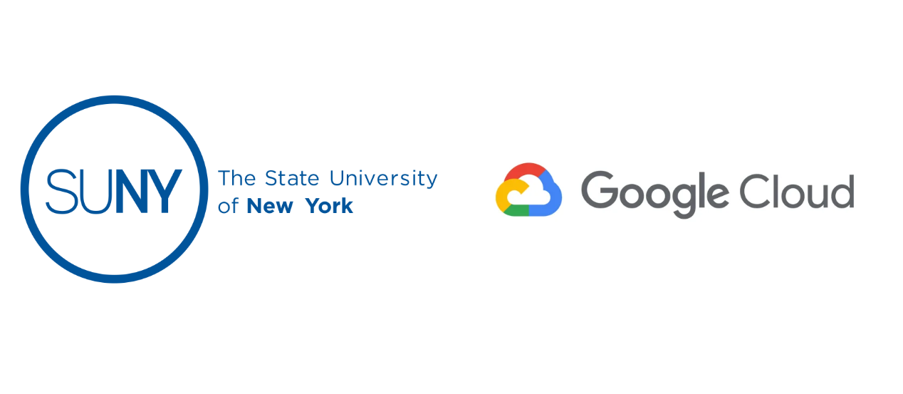

# SUNY AI Platform FAQ: A Customized Guide for Researcher Access

Welcome, SUNY researchers! We're excited to have you on the Google Cloud Platform (GCP). This guide is designed to help you tackle a few common technical questions with easy-to-follow steps.
The Google Cloud and SUNY Administration team are thrilled to announce that your dedicated Google Cloud pilot project within the SUNY AI Platform has now been provisioned! This marks a significant milestone in this project to empower advanced research and education across the SUNY system. It directly addresses critical research needs such as workflow inefficiencies, complex data management, and collaboration barriers. Below are a list of common scenarios that we’ve seen from SUNY researchers:

### 🔑 0. How do I log into the SUNY AI Platform with my SUNY Credentials

You cannot access the platform using the standard Google Cloud homepage (console.cloud.google.com). Because the SUNY AI Platform uses a federated identity system, you must initiate your session through the specific SUNY portal link.
Please follow these steps:
- Navigate to the Portal: Click the [SUNY AI Platform Login Link] (Bookmark this URL for future access).
- Select Your Institution: From the dropdown menu, locate and select your Home Campus.
- Authenticate: You will be redirected to your campus login page. Sign in using your standard Campus Credentials (the same GlobalID and password you use for university email or portals).
- Select Your Project: Once redirected to the Google Cloud Console, open the project selector dropdown (top left of the screen) and select your assigned project.
- Project Naming Convention: [CAMPUS]-prj-[RESEARCHER_NAME]-sbx

### 🔑 1. How do I connect to my Virtual Machine (VM) from my local terminal?

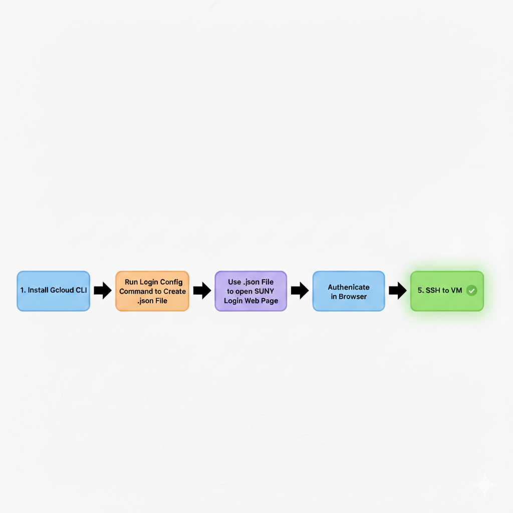

Connecting to your VM securely can be done using SSH via your local terminal. Because our platform uses a secure central login system (called Workforce Identity Federation), there's a quick, one-time setup on your computer to make sure it's you!
- Install the Google Cloud CLI: If you haven't already, you'll need to install the gcloud command-line tool. Just follow the official instructions for your operating system.
- Link: Google Cloud SDK Installation Instructions
- Configure Your Login: Open your local terminal (like Terminal on macOS, or PowerShell/WSL on Windows) and run the following command. This downloads the special login configuration for the SUNY platform and saves it as a file named gcloud.json.
gcloud iam workforce-pools create-login-config locations/global/workforcePools/suny-wfif-pool-glb/providers/suny-wfif-pvdr-glb --output-file=gcloud.json
- Log In!: Now, run this command. It will use the file you just created to open a SUNY login page in your web browser.
gcloud auth login --login-config="gcloud.json"
- Authenticate in Browser: Follow the steps, logging in with your usual university credentials on the web page that pops up. Once you're done, your terminal will be securely connected and be ready to go!
- Action: To confirm that the CLI is authenticated, run a command to list the projects you have access to. If the command successfully returns a list of your assigned projects, the setup is complete.
gcloud projects list
- Connect to Your VM: You can now connect to your VM using the standard gcloud compute ssh command. To find the exact command for your VM:
- In the Google Cloud Console, navigate to Compute Engine > VM instances.
- Find your VM in the list.
- To the right of the VM name, click the SSH dropdown arrow.
- Select View gcloud command.
- A pop-up window will show the exact command. You can copy and paste this directly into your terminal
- After entering this command, if prompted by your local terminal to store credential in cache, type yes

| Pro Tip 1 : You only need to run the create-login-config command (Step 2) once per computer. After that, you'll just use gcloud auth login when you need to re-authenticate! |
| --- |

### 💡 2. How to Authenticate to the Gemini CLI

Configure Authentication for the CLI:
The Gemini CLI needs to be configured to use your authenticated gcloud credentials. Run the following commands to set this up:
- Download the Gemini CLI - https://github.com/google-gemini/gemini-cli?tab=readme-ov-file#-installation
- Install globally with npm (recommended) npm install -g @google/gemini-cli
# Set your Google Cloud Project
export GOOGLE_CLOUD_PROJECT="YOUR_PROJECT_ID"
export GOOGLE_CLOUD_LOCATION="YOUR_PROJECT_LOCATION" # e.g. "us-central1"
# This command uses your login-config file to create ADC.
gcloud auth application-default login --login-config="gcloud.json"
Then select option “3. Vertex AI” as shown below

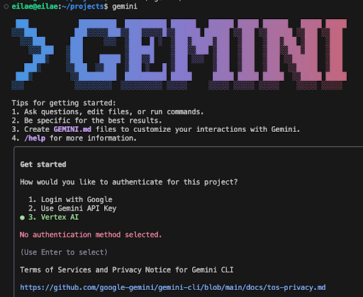

The Gemini CLI is part of the Google Cloud SDK and uses the same authentication as your gcloud tool.
- If You Get an Error: If you run a gemini command (like gemini chat) and get an authentication error, it likely means your main gcloud credentials have expired.
- The Fix: Simply re-authenticate by running the login command from Section 1:
gcloud auth application-default login --login-config="gcloud.json"

### 🌐 3. What networking range should I select when configuring a VM?

To prevent IP address conflicts and keep the platform secure and organized, the networking ranges are managed centrally.  This means you don't have to guess or make one up.
What to Do:
When you are configuring a new VM and need to assign it to a specific network or subnetwork, the range is pre-determined for your campus or research project.
During the VM creation process, in the Networking section, you will see a dropdown menu for Network interfaces. Select Networks shared with me and then select the subnet that contains the word standard as shown in the screenshot below.

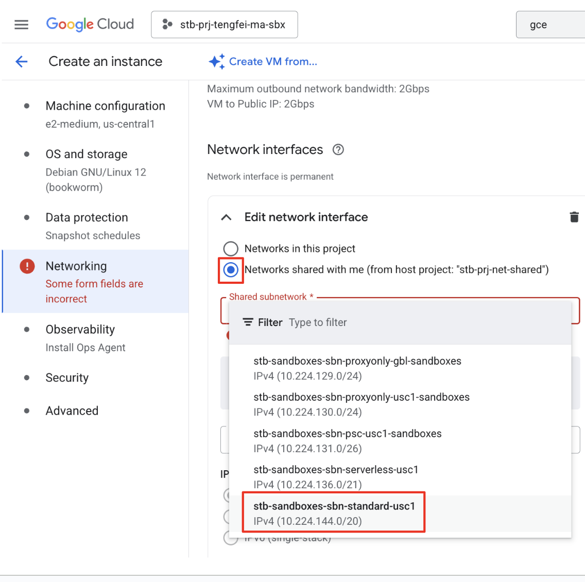

| *Each shared subnetwork will be prepended with the 3 letter acronym (e.g STB, BUF, SYR) for your respective university, please select the subnet for the university that you are situated in. |
| --- |

### 📈 4. How do I request a quota increase for more resources?

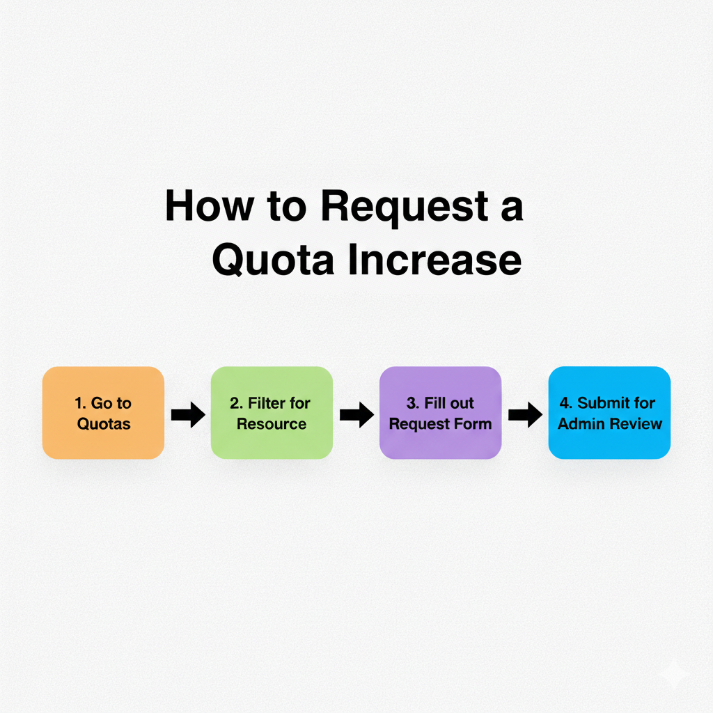

Sometimes your research needs a little more power, like more GPUs or CPUs than you were initially assigned. These limits are called "quotas," and you can easily request an increase.
- Navigate to Quotas: In the Google Cloud Console, go to the IAM & Admin section and select Quotas & System Limits.
- Find Your Quota: Use the filter bar to find the resource you need more of. For example, you can filter for GPU or a specific machine type.
- Select and Edit: Check the box next to the quota(s) you want to increase and then click "Edit" in the banner that appears at the top.
- Fill Out the Form: A panel will appear on the right. Enter your requested new limit and, most importantly, provide a brief but clear reason for the request (e.g., "Need to train a larger deep learning model for Project X, which requires 2 A100 GPUs").
- Submit! Your request will be sent to the administrators for review. Most requests will be approved within a few minutes. You will be notified if otherwise.
For more technical details on how quotas and limits work, you can check out the official documentation.
- Link: Working with Quotas | Google Cloud

### 🔐 5. How do I Authenticate for Local Development (SDKs & Client Libraries)?

When you run code locally (e.g., a Python script on your laptop) that needs to talk to Google Cloud APIs, you must authenticate using Application Default Credentials (ADC). This is different from the gcloud auth login command, which is just for using the terminal.
- For gcloud CLI commands:
- Use the command below as described in Section 1. This authenticates you for running gcloud commands in your terminal.
gcloud auth login --login-config="gcloud.json"
- For local Python/Java/etc. code (Client Libraries):
- Use the command below. This command creates a special credential file on your computer that Google's client libraries (like the Vertex AI SDK) can automatically find and use to authenticate as you.
- Links: Python Client Library Docs and Vertex AI SDKs Overview
gcloud auth application-default login --login-config="gcloud.json"

### 💵 6. How do I review Billing Usage associated with my Project?

You need to be in the Google Cloud Console and have the correct project selected.
Step 1: Select Your Project
- Sign in to the Google Cloud Console via the prescribed link with your SUNY edu credentials
- At the very top of the page, locate the Project selector dropdown. It typically displays the name of the project you are currently viewing.
- Click the project name (e.g., CAMPUS-prj-NAME-sbx) to open the project selector dialog.
- Verify that the project you are interested in (the one you're currently in) is selected. If not, find it and select it.
Step 2: Navigate to the Billing Section
- Click the Navigation Menu (the three horizontal lines) in the top-left corner of the console.
- In the menu that appears, scroll down and click Billing.

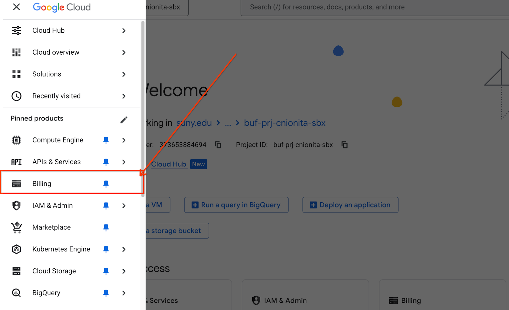

Step 3: Go to the Linked Billing Account
The action you take next depends on what you see:
- You will see a prompt indicating the project is linked to a billing account, click Go to linked billing account.
- Under reports you will be able to see your current consumption under your selected project

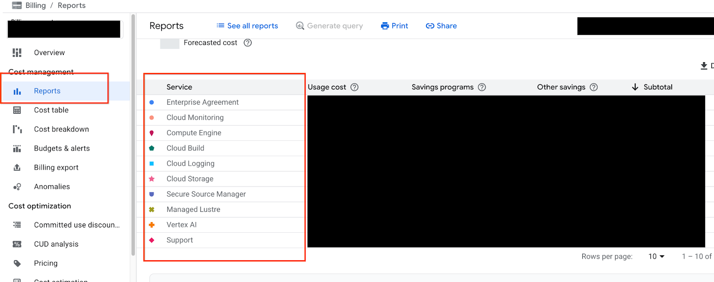

### 🧑‍💻 7. VS Code Workaround: How do I connect VS Code to my Virtual Machine (VM)?

Prereqs
- The Remote Development Extension Pack is installed
Step 1
Run the command below
gcloud beta compute ssh --zone "[MY_VM_ZONE]" "[MY_VM_NAME]" --tunnel-through-iap --project "[MY_PROJECT_ID]" --dry-run

Replace the placeholders below with appropriate values
[MY_VM_ZONE]: The zone where your VM is located (e.g., us-central1-a).
[MY_VM_NAME]: The name of your VM in GCP
[MY_PROJECT_ID]: The project ID of your GCP Project.

Step 2
Copy the ssh command that’s provided in the output of the command. Exclude the beginning of the output so that what you copy starts with ssh (like what’s highlighted in the image below)

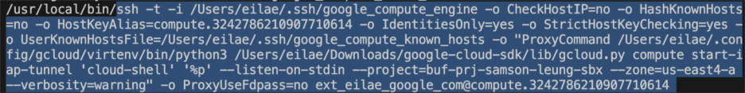

Step 3
Click the Remote “Quick Access” icon in the lower left corner

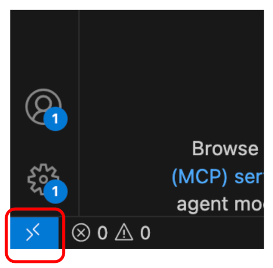

Step 4
Select “Connect to Host” in the Command Palette

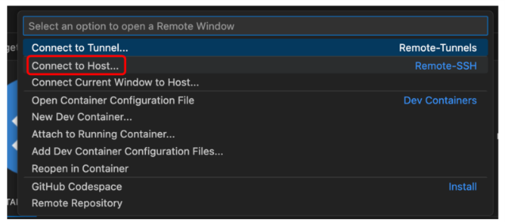

Step 5
Select “+ Add New SSH Host”

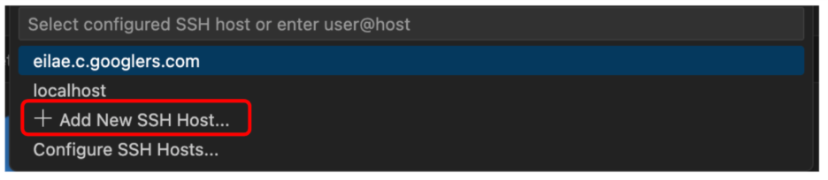

Step 6
Enter the ssh command from Step 2 into the command palette
Step 7

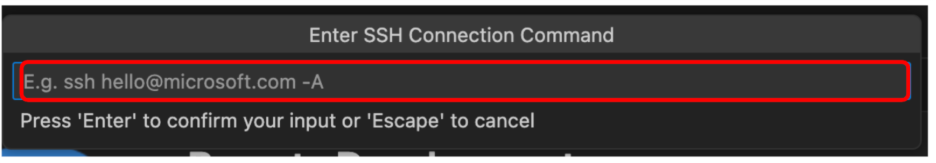

Select the SSH configuration file to update

Step 8
In the bottom right corner, click “Connect”
Next Steps

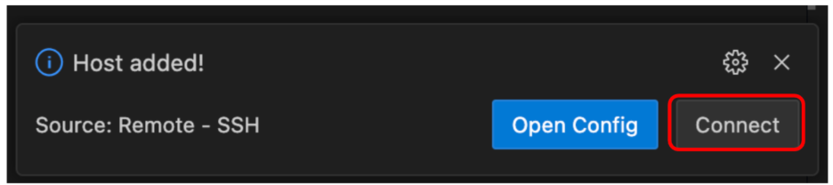

The next time you want to connect to the VM, repeat steps 3 and 4. Then, the VM should appear as an option to select.

## 📓 8. How do I setup a Vertex AI Workbench instance?

Vertex AI Workbench provides a managed JupyterLab environment that is pre-integrated with deep learning frameworks like TensorFlow and PyTorch, as well as SUNY's data tools. These instances are ideal for experimentation and collaborative research.

### Step 1: Navigate to Workbench

- Sign in to the Google Cloud Console using your SUNY credentials.
- Use the Project selector at the top to ensure your research project is selected (e.g., BUF-prj-NAME-sbx).
- Open the Navigation Menu (three horizontal lines) and select Vertex AI > Workbench.

### Step 2: Create a New Instance

- Click + CREATE NEW from the top menu.
- Details:
- Name: Provide a unique name for your instance.
- Region: Select the region geographically closest to you for better performance (e.g., us-central1).
- Machine type: Select the number of CPUs and RAM required. If your research involves deep learning, toggle the GPU option and select a type (e.g., NVIDIA T4 or A100).
- Note: Ensure "Install NVIDIA GPU driver automatically for me" is checked.

### Step 3: Configure Networking (Crucial for SUNY Researchers)

To ensure your instance connects to the secure SUNY network and avoids IP conflicts, you must use the shared VPC settings.
- Click Advanced Options at the bottom of the creation panel.
- Navigate to the Networking section.
- Select Networks shared with me.
- In the Subnetwork dropdown, select the subnet that contains your university's 3-letter acronym and the word standard (e.g., stb-sandboxes-sbn-standard-usc1).
- Uncheck "Assign external IP address" to keep your environment secure.

### Step 4: Finalize and Open

- Click CREATE at the bottom. It typically takes a few minutes to provision.
- Once the status shows a green checkmark, click OPEN JUPYTERLAB next to the instance name.
- Your environment is now ready for coding!

## 🚫 9. Is Colab Enterprise available?

Please note that Colab Enterprise is not in use at this moment in time for the SUNY AI Platform.
Researchers requiring a collaborative, cloud-based notebook environment should use Vertex AI Workbench, as detailed in Section 8 above. Vertex AI Workbench offers a similar JupyterLab experience with the added benefit of full integration into SUNY’s secure networking and data management infrastructure.
While both platforms offer a cloud-based Jupyter Notebook experience, they are designed for different stages of the research and development lifecycle. Vertex AI Workbench is a professional-grade environment integrated with enterprise infrastructure, whereas Standard Colab is a lightweight, zero-configuration tool for quick prototyping and learning.

### Key Feature Comparison

| Feature | Standard Google Colab | Vertex AI Workbench |
| --- | --- | --- |
| Primary Purpose | Personal research, education, and quick prototyping. | Enterprise-level ML development and end-to-end production. |
| Compute Resources | Managed, shared resources; limits on CPU/RAM and runtime duration. | Dedicated, customizable VM instances with flexible CPU/RAM/GPU configurations. |
| Persistence | Runtimes are temporary; local files are lost when the session ends. | Persistent storage on Google Cloud Disk; data and configurations remain between sessions. |
| Networking | Standard public internet access; no VPC integration. | Fully supports Shared VPC networking and secure private connectivity. |
| Customization | Limited to installing libraries in the current session. | Full control over the OS, custom conda environments, and custom Docker containers. |
| Integrations | Primarily integrates with Google Drive and GitHub. | Native integration with BigQuery, Spark, Dataproc, and the full Vertex AI stack. |
| Security | Standard Google account security. | Identity and Access Management (IAM), VPC Service Controls, and Workforce Identity. |

## 10. I need access to Gemini API Keys

The SUNY AI Platform currently prevents users from creating their own API Key for security reasons. By disallowing the creation of these keys, SUNY forces your applications and services to rely on more secure, managed credentials, such as Application Default Credentials (ADC).
For workloads running outside of Google you will need to follow the Application Default Login steps listed in Section 5 above. Once complete, instantiate the client as documented in the image below:

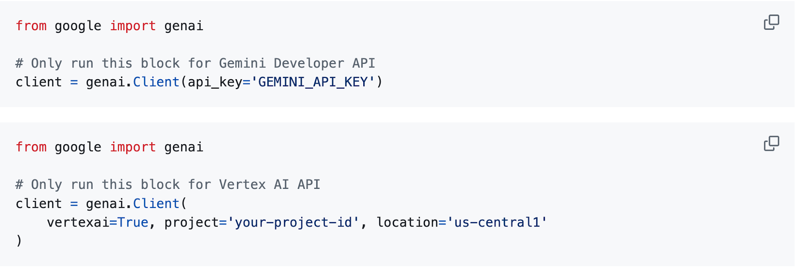

For workloads running within Google Cloud then you do not need access to API Keys, and you can just instantiate the client as documented in the image below:

## 11. How do I access highly sought after GPUs, such as H100s, using Dynamic Workload Scheduler?

Due to high demand, high-performance GPUs like the NVIDIA H100 (A3 machine series) are often difficult to provision when requesting standard "On-Demand" instances. To improve your chances of securing these resources for specific experiments or training runs, you should use Dynamic Workload Scheduler (DWS).
DWS allows you to request a VM for a specific amount of time (up to 7 days). Google Cloud will queue your request and provision the VM as soon as the capacity becomes available. Once the VM starts, it is guaranteed to run for the duration you selected without interruption.
Step 1: Configure the VM in Console
- Navigate to Compute Engine > VM instances and click CREATE INSTANCE.
- Machine Configuration: Select the GPU tab.
- GPU Type: Select NVIDIA H100 (80GB) (Note: This requires the A3 machine series).
Step 2: Select the Provisioning Model
- Scroll down to the Advanced options section (often collapsed).
- Find the Management dropdown.
- Under Availability policy, look for Provisioning model.
- Select Dynamic Workload Scheduler.
- Note: If you do not see this option, ensure you have selected a region that supports H100s (e.g., us-central1 or us-east1).
Step 3: Set Duration
- Enter the Run duration. This is the exact amount of time you need the VM for (e.g., 2 Days, 4 Hours).
- Maximum duration is 7 days.
- Networking: Don’t forget to follow the networking steps in Section 3 of this guide (Select "Networks shared with me").
- Click CREATE.
⚠️ Important Limitations & Warnings
Using DWS is different from a standard VM. Please keep the following in mind to avoid data loss:
- The VM Terminate Automatically: Once your "Run duration" timer runs out, the VM will automatically shut down and be deleted. It cannot be extended.
- Data Persistence: Because the VM deletes itself, do not save critical data on the Boot Disk.
- Action: Ensure your training script saves checkpoints and results to a Google Cloud Storage (GCS) bucket or a mounted persistent disk that is separate from the boot disk.
- Start Times vary: The VM might not start immediately. It enters a queue and begins when hardware is available.

## 12. Why does gcloud compute ssh fail on Windows with "No supported authentication methods available"?

Root Cause:
This issue is caused by a conflict between the Google Cloud SDK and the SSH client being used. On Windows, gcloud often defaults to using PuTTY/Plink (bundled within the SDK) rather than the native Windows OpenSSH client. If your machine has environment variables pointing to legacy PuTTY installations, gcloud may attempt to use a key format (.ppk) that the VM does not recognize.
Solution:
To resolve this, you must force gcloud to use the native Windows OpenSSH client.
Step 1: Verify Authentication
Before troubleshooting SSH, ensure your authentication tokens are active by running both:
gcloud auth login
gcloud auth application-default login
Step 2: Force OpenSSH via Environment Variable
Open PowerShell as Administrator and run the following command to point gcloud explicitly to the Windows OpenSSH executable:
[Environment]::SetEnvironmentVariable("GIT_SSH", "C:\Windows\System32\OpenSSH\ssh.exe", "User")
Note: Restart your terminal (and potentially your IDE like VS Code) after running this for the change to take effect.
Step 3: Update gcloud Configuration
Run the following command to tell gcloud to prefer the system SSH client:
gcloud config set ssh/use_ssh_client true
Step 4: Advanced Troubleshooting (Last Resort)
If the issue persists, you may need to manually modify the SDK logic to ignore Windows-specific PuTTY checks.
- Navigate to: C:\Users\<YourUser>\AppData\Local\Google\Cloud SDK\google-cloud-sdk\lib\googlecloudsdk\command_lib\util\ssh\ssh.py
- Open the file in a text editor (e.g., Notepad).
- Search for the line: if platforms.OperatingSystem.IsWindows():
- Change it to: if not platforms.OperatingSystem.IsWindows():
- Save the file and retry the connection.

## Contact List:

- For additional administrative program information about the SUNY AI Platform project, please email Catherine Stollar Peters at catherine.stollarpeters@suny.edu
- For troubleshooting guidance on the topics covered in this guide, please first reach out on the Slack Channel, or second email suny-google-team@google.com
Help Services:
- Remember to provide a project lead for communication to the various Google help services should your project need troubleshooting. This is to avoid a major traffic jam of help inquiries (multiple per project). Send your contact to sarah.imboden@suny.edu
- See below for a Cloud Skills Boost Guide. It is a free, licensed service that is very helpful for learning your way around GCP. Please use it! Using it does not count toward your credits.
- Slack: https://join.slack.com/t/suny-network/shared_invite/zt-3kws19c05-xtM9zdGjEoppFf9YS2VS8g
- Office Hours: Google is offering Office Hours on Mondays, Wednesdays, and Fridays at 10am at this link: https://meet.google.com/ovj-heiz-nmk (drop in)

We hope this guide is helpful!
SUNY AI Platform Team

Cloud Skills Boost Guide: Elevate Your Cloud Skills with Google Cloud Skills Boost

Researchers across SUNY can elevate their cloud computing skills by leveraging Google Cloud Skills Boost, Google's official learning platform. This platform provides a wide range of educational resources, including various learning paths, comprehensive courses, and hands-on training opportunities through temporary lab environments. With a vast catalog of over 980 learning activities, researchers have access to an extensive collection of content designed to help them acquire essential current skills and develop new ones for future projects.

To use Cloud Skills Boost, follow these steps:
- Navigate to this address: https://www.skills.google/organizations/state-university-of-new-york/invites/researchers
- Use your campus email address to create an account on Google Cloud Skills Boost.
- If you are asked to add a birth date, please choose something that is over 18. No need to include your true date of birth.
- If you have created a new account, Google Cloud Skills Boost will send a second email to have you verify your account and sign in.
- Once signed in, you will see a bell icon on your account profile on the top right-hand corner of the Google Cloud Skills Boost homepage. Click on the profile icon and you will see a pending notification. Click on “invitation” and accept it.

Cloud Skills Boost Link
Below are some examples of the content available on Cloud Skills Boost

| Topic | Courses/Learning Paths |
| --- | --- |
| Big Data & Analytics | Derive Insights from BigQuery Data  BigQuery for Data Analysts  Data Engineering, Big Data, and ML on Google Cloud  Integrate Generative AI Into Your Data Workflow |
| Artificial Intelligence (AI) & ML | Introduction to AI and Machine Learning on Google Cloud Machine Learning Engineer Learning Path Prompt Design in Vertex AI  Natural Language Processing on Google Cloud |
| Cloud Computing Fundamentals | Getting Started with Google Cloud  Cloud Digital Leader Google Cloud Fundamentals: Core Infrastructure |

