```mermaid
graph TD
    subgraph "Setup & Configuration"
        direction LR
        S[("metadata_schema.yml<br><i>Shared Contract</i>")];
    end

    subgraph "1. Automated Data Ingestion & Enrichment Pipeline"
        direction LR
        A[/"Admin/User<br>Uploads File"/] --> B[(Staging GCS Bucket)];
        B -- CloudEvent Trigger --> C{Cloud Function<br>process_file_for_metadata};
        
        S --> |Guides Prompt| C;

        C --> |1. Extract Text| D[Extracted Text];
        D --> |2. Build Prompt| E[Prompt for Gemini Model<br><i>&quot;Generate metadata based on schema...&quot;</i>];
        E --> F((Vertex AI<br>Gemini 1.5 Flash));
        F --> |3. Receive JSON| G[Generated Metadata];
        
        subgraph "Store Processed Artifacts"
            direction TB
            D --> H[(Processed GCS Bucket<br>/processed_text/*.txt)];
            G --> I[Formatted JSONL Entry];
            I --> J[(Processed GCS Bucket<br>/metadata_entries/*.jsonl)];
        end
    end

    subgraph "2. Datastore Indexing"
        direction LR
        K[Manual or CI/CD Trigger] --> L{Datastore Import Job<br><i>recreate_datastore_from_gcs.py</i>};
        L -- Reads --> J;
        L -- Creates/Updates --> M((Discovery Engine Datastore<br><i>ebt-corpus-recreated</i>));
        M -- Indexes --> H;
    end
    
    subgraph "3. Real-time RAG Retrieval"
        direction LR
        N[Therapist & Patient<br>in Session] --> O{Frontend};
        O -- "Transcript Segment" --> P(Backend: therapy-analysis-function);
        
        subgraph "Inside therapy-analysis-function"
            P --> Q{main.py<br>Builds Search Query};
            R[constants.py] --> Q;
            S --> |Guides Filter Logic| R;
            Q -- "Search&#40;filter='modality==DBT'&#41;" --> M;
        end

        M -- "Filtered Results<br>(Grounding Documents)" --> P;
        P -- "AI-generated<br>Clinical Insight" --> O;
    end
```

### Explanation of the Diagram

This updated diagram introduces a central **Shared Contract** (`metadata_schema.yml`) to govern the entire pipeline, ensuring consistency and making the system more robust and extensible.

1.  **The Shared Contract (`metadata_schema.yml`):**
    *   This new component is a configuration file (e.g., YAML or JSON) that acts as the single source of truth for the metadata structure.
    *   It defines which fields should be generated (e.g., `title`, `summary`, `tags`, `modality`) and, for fields with controlled vocabularies, the allowed values (e.g., `modality: ["CBT", "DBT", "BA", "IPT"]`).

2.  **Automated Data Ingestion & Enrichment Pipeline:**
    *   An admin uploads any supported file type (not just PDFs).
    *   The Cloud Function (`process_file_for_metadata`) is now guided by the `metadata_schema.yml`. It uses this schema to construct a more precise prompt for the Gemini model, ensuring the AI generates metadata that conforms to the expected structure and values.

3.  **Datastore Indexing:**
    *   This stage remains the same. The import process is agnostic to the *content* of the metadata, it just attaches the `structData` from the JSONL file to the corresponding documents in the Discovery Engine datastore.

4.  **Real-time RAG Retrieval:**
    *   The `therapy-analysis-function` also reads from the `metadata_schema.yml` (likely loaded into its `constants.py`).
    *   This ensures that when the backend builds a search query, it uses the exact field names (`modality`) and potential values (`"DBT"`) defined in the shared contract.
    *   This **prevents sync drift**. If a new modality is added to the schema, both the generation and retrieval parts of the system are updated from the same source, guaranteeing that the filtering logic will work correctly.

This architecture makes the system highly extensible and reliable. Adding a new filterable field or a new modality becomes a simple matter of updating the central `metadata_schema.yml` file.
